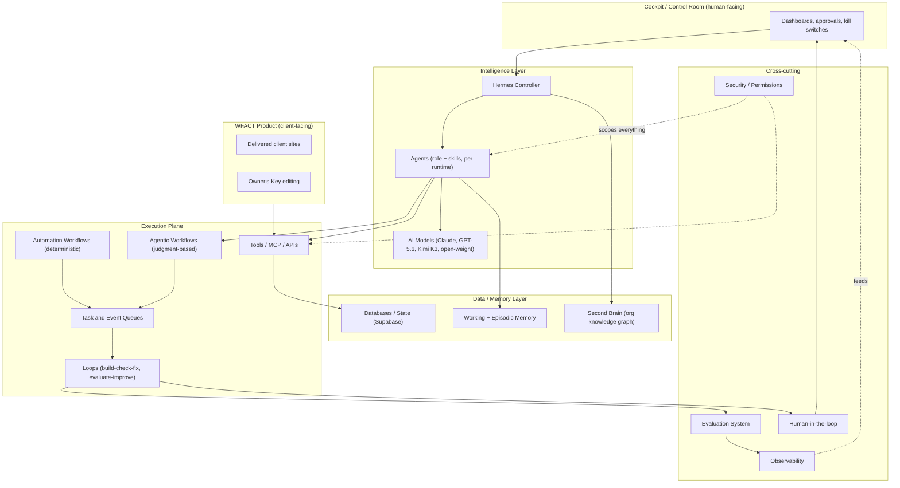
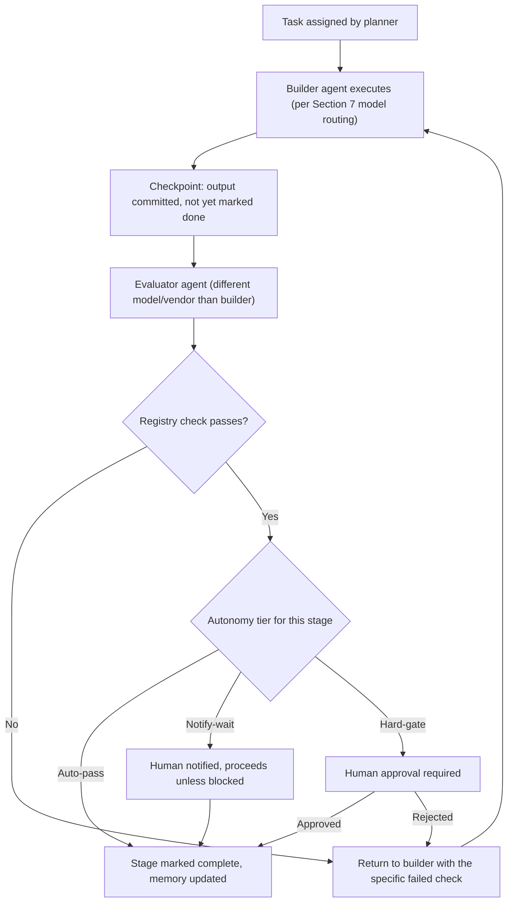
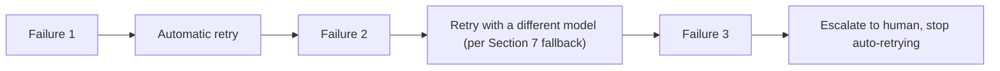
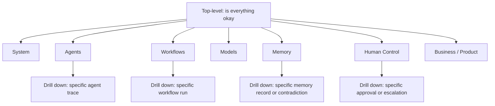
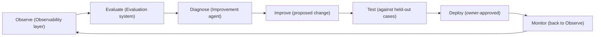

# WFACT 3.0: The Complete Ecosystem Blueprint

Research standard: current as of August 26, 2026. Every model, framework, and tool claim below is checked against benchmarks, vendor documentation, or engineering research published in 2026, sources listed inline and in Section 16H. Nothing here is preserved from 2.0 just because it already exists. Compensation, roles, and scope are intentionally out of this document.

A calibration note, added after review: a document like this can blur the line between what the team actually decided and what was only raised as a possibility on a call. Where that distinction matters, this version says so explicitly: "confirmed" or "agreed" means the team settled it; "candidate," "leading option," or "still being tested" means it was discussed but not locked; anything framed as a recommendation is Huraira's own technical judgment, offered for the team to accept or override, not a decision already made on his behalf.

---

## 1. Audit: WFACT 2.0 to WFACT 3.0

### Classification

| Component (2.0) | Verdict | Reasoning |
|---|---|---|
| 78-check feature registry | **KEEP** | The one thing that caught the FINAL-ADDITIONS-3 install failure. This is the seed of the Evaluation Registry in Section 14. |
| 50-point security audit + attack scripts | **KEEP** | Real attacks (RLS, upload), real pass/fail, honest NOT-COVERED labeling. Extend it, do not replace it. |
| Owner's Key (client self-edit) | **KEEP** | Proven by attack: isolation held, upload gates held. |
| Entity law (down to 2 companies for the 3.0 build phase, per Nick's Aug 26+ correction, 1 client each) | **KEEP** | Simple, already enforced by test (caught an invoice numbering bug). Nick has separate SaaS plans that will reintroduce more entities later; keep the underlying model N-capable rather than hardcoded to 2, so that expansion doesn't require a redesign. |
| Hosting law (Hostinger live, Vercel preview) | **KEEP** | Zero ambiguity, already scripted. |
| Template-first doctrine | **KEEP for now, with an expiry condition** | Only proven path to a full rebuild (DreamSign). Do not lift it until the registry shows N consecutive from-scratch builds passing at the same defect rate. |
| Amir (Claude-API chat, Approval Inbox, mail engine) | **REPLACE** | The mail engine, event detection, and Approval Inbox patterns are sound and should be kept as capabilities. The controller identity ("Amir") is replaced by Hermes per team decision. This is a swap of the orchestrator, not a redesign of the approval mechanics. |
| Amir memory / diary (Supabase table, never fully wired) | **REPLACE** | Superseded by the full memory architecture in Section 8. A single unstructured table was never going to be the second brain. |
| Cockpit (React PWA + Supabase) | **FIX** | Sound foundation, real problem: 12/12 Vercel Hobby serverless function ceiling already caused a silent outage. Fix before scale, do not rebuild from zero. |
| Cockpit rooms (Today, Pipeline, Approvals, Runs, Money, SEO, Content, Health, Calendar, Team) | **FIX and EXTEND** | Good shape, missing the observability, model, and memory dashboards required for an agentic system (Section 9). |
| Client timeline (a heading, not a built tab) | **FIX** | Half-built. Finish it, it is a real gap in the Pipeline room. |
| 12-function serverless ceiling | **FIX (infrastructure)** | Root-caused already. Upgrade the plan or move heavier logic off serverless functions before the next outage, not after. |
| Fuel Gauges, Cost Sentinel | **KEEP, extend into Cost Governance** | The instinct is right (budget alerts before overrun). Formalize as the cost-control layer described in Section 3 rather than a standalone panel nobody clicked (2.0's own audit flagged the panel as never verified in production). |
| Voice mode | **DEFER** | Never verified even once. Not a dependency for anything else. Revisit after Phase 2. |
| Scroll-film studio | **REMOVE (per Nick's Aug 26+ correction)** | Its origin: Nick's own hands-on teaching reference to Amir and the factory on 2.0 for how motion and animation should look, which is why the term persists across the 2.0 documents. It is not a tool to carry forward. Fully retired in favor of Motion Sites MCP + 21st.dev MCP, per the team's new front-end direction. |
| Strix (AI pentesting) | **REMOVE (already correctly removed)** | Never ran once, replaced by DeepSource. Keep it removed, keep the test guarding its return. |
| Follower tracking | **REMOVE (already correctly removed)** | Confirmed low value, no reason to resurrect. |
| Experience Charter, Concept Pitch, invention mandate (retired doctrines) | **REMOVE (already correctly removed)** | Do not resurrect ceremony that got demoted for a reason. |
| Prompt bank (254 motionsites.ai prompts, 25/254 actually read) | **REMOVE** (per Nick's Aug 26+ correction) | Retired outright rather than fixed. Superseded by Motion Sites MCP + 21st.dev MCP (premium account already purchased) driving front-end generation directly, with the second brain's rules replacing what the prompt bank was trying to encode. |
| The Eyes (self-review scroll recording) | **KEEP** | Genuinely proven pattern: catch defects before a human or client sees them. Generalize it into the per-stage evaluator pattern in Section 5, not just a front-end-only step. |
| Cross-entity invoice numbering, deploy freshness guard, branch protection | **KEEP** | All three were proven by a real caught bug or a real test. |
| "Tells" list (20 vibecode signs) | **FIX** | Written, never confirmed running. Wire it into the registry as an actual gate, not a draft. |
| Second brain (Obsidian + GitHub + Hermes, prior attempt) | **REPLACE** | Directionally right, operationally incomplete (leaked technical detail into chat, never structured). Full redesign in Section 8. |

### Architectural debt carried from 2.0 that must not repeat

1. **"Done" meant "an agent said so."** The single biggest failure (a whole pack silently never installed) happened because nothing outside the builder verified the build. Section 3 and Section 12 make independent verification structural, not optional.
2. **No observability layer.** 2.0 had reports and a registry, not real-time tracing of what an agent did and why. Section 3 and Section 13 fix this with dedicated observability tooling, not ad hoc logging.
3. **Memory was an afterthought.** A single Supabase table nobody finished wiring. Section 8 treats memory as a first-class subsystem with its own retrieval, decay, and conflict-resolution design.
4. **No task/event queue.** Headless runs went straight from cockpit click to GitHub Actions. That works at one project at a time; it does not survive concurrent clients. Section 14 adds this explicitly.
5. **Multi-agent work was never load-tested for the failure mode it actually has.** Sequential, dependent agent chains compound error multiplicatively (see Section 3 and Section 12 for the research). 2.0 never measured this. 3.0 must, before scaling loops.

---

## 2. The WFACT 3.0 Ecosystem: Components and Boundaries

| Component | Owns | Must never own |
|---|---|---|
| **WFACT Product** | The client-facing and eventual SaaS-facing surface: the actual delivered websites, the Owner's Key editing experience, client-visible reports | Internal operational logic, agent orchestration, cost/model routing decisions |
| **Cockpit / Control Room** | Human visibility and control over the whole factory: approvals, dashboards, overrides, kill switches | Business logic execution itself. It displays and gates, it does not compute the work. |
| **Hermes Controller** | Task decomposition, routing decisions, scheduling, escalation, high-level state | Direct code execution, direct tool calls to production systems, final approval on money or launch |
| **AI Models** | Producing outputs (code, copy, images, decisions) when invoked by an agent | Persisting their own state across sessions, holding permissions directly, deciding when they are "done" without a check |
| **Agents** | A defined role plus a skillset, executed inside a runtime, for a bounded task | Standing memory outside the memory layer, direct database writes without going through defined tools |
| **Agentic Workflows** | Non-deterministic, model-driven sequences with judgment calls (research, design decisions, debugging strategy) | Deterministic business processes better served by a workflow engine (invoicing, notifications) |
| **Automation Workflows** | Deterministic, rule-based sequences (send an email on event X, run a cron job) | Judgment calls, anything requiring model reasoning about ambiguous input |
| **Loops** | Repeating cycles with an exit condition (build-check-fix, evaluate-improve) | Anything that should run exactly once |
| **Memory** | Facts, state, and history that need to be recalled | Business rules that should be code/config, not recalled prose |
| **Second Brain / Knowledge Layer** | Organizational knowledge: what the business is, what was decided, what was learned | Real-time operational state (that is Memory / State, see below) |
| **Tools / MCP / APIs / Integrations** | The concrete interface an agent uses to act (call an API, edit a file, query a database) | Deciding what to do. Tools execute, they do not decide. |
| **Databases / State** | Durable, structured records: clients, projects, invoices, task status | Unstructured "what happened and why" narrative, that belongs in Memory |
| **Observability** | Tracing, logging, cost and latency visibility across every agent and workflow run | Making decisions about what to do differently. It reports, humans or the improvement loop decide. |
| **Evaluation System** | Scoring whether an output actually met the bar, independent of the agent that produced it | Producing the work being evaluated. The evaluator is never the same instance as the builder. |
| **Human-in-the-loop** | Approval on anything irreversible: launch, money, client-facing sends | Routine, reversible, already-verified actions. Overusing this makes humans a bottleneck and a rubber stamp. |
| **Security / Permissions** | Least-privilege scoping of every agent and tool, secrets management, audit trail | Feature logic. Security is a boundary layer, not a workflow step. |
| **Task and Event Queues** | Ordering, retrying, and buffering work so concurrent clients do not collide | Business logic. A queue moves work, it does not decide what the work should be. |

---

## 3. WFACT 3.0 Core Architecture

### The four layers

- **Control plane**: Cockpit + Hermes. Decides what should happen and shows humans what is happening. No heavy compute lives here.
- **Execution plane**: Agents, workflows, loops, tools, queues. Where work actually happens.
- **Intelligence layer**: The models themselves, routed per task (Section 7).
- **Data/memory layer**: Supabase (state), the memory system (Section 8), the second brain (org knowledge).

### Cross-cutting design decisions

| Concern | Decision | Why |
|---|---|---|
| **Orchestration** | Hermes as the single controller, pairs with a durable execution engine underneath for anything long-running. Production practice in 2026 has converged on exactly this "framework inside engine" pairing: an agent framework defines the logic, a durable engine (Temporal or a self-hostable equivalent like n8n) executes it and survives restarts. OpenAI itself runs Codex production workloads on Temporal for this reason. | Hermes alone (like a raw LangGraph agent) loses state on a process restart. That is fine for a chat assistant, not fine for a headless build that runs for hours. |
| **Task execution** | Every unit of work is a typed task object with an owner, a deadline, and a retry budget, not a free-form prompt. | Prevents the "agent said it's done" failure mode; a task either meets its schema or it does not. |
| **Agent lifecycle** | Spawn on demand inside a runtime (Claude Code, Codex, Kimi Code session), execute a bounded task, report a structured result, terminate. No standing agent processes outside Hermes itself and any scheduled cron jobs. | Matches how the team already reasons about this ("agents live inside whichever runtime executes them"), and avoids the cost and drift of always-on agent processes. |
| **Workflow execution** | Agentic workflows (judgment-based) run inside the agent framework layer; automation workflows (deterministic) run on the durable engine directly, no model call needed. | Do not spend a model call on something a cron job or a webhook already solves. |
| **Event-driven architecture** | Internal event bus (see Section 14) instead of direct service-to-service calls. Onboarding, stage transitions, and approvals all emit events; consumers (Hermes, the cockpit, notifications) subscribe rather than being hardcoded into each other. | 2.0's mail-engine-as-event-bus pattern was cheap and worked; 3.0 needs the same principle applied factory-wide, not just to email. |
| **State management** | Supabase remains the system of record for structured state (clients, projects, tasks, invoices). The durable engine holds workflow-run state. Memory holds everything else. | Three different kinds of state need three different stores; forcing them into one table is what half-broke Amir's memory in 2.0. |
| **Queues, retries, scheduling** | A real task queue (Section 14) in front of the durable engine; retries follow an exponential backoff with a hard cap, then escalate to a human, never retry silently forever. | Prevents a stuck loop from burning API budget unattended, a real, named risk in agentic systems. |
| **Tool calling** | Every tool call goes through a schema-validated wrapper with an allowlist, never a raw shell command from model output. | This is the direct fix for the exact class of attack that hit Gemini CLI in May 2026 (a malicious npm package's code comments triggered arbitrary shell execution through an agent that trusted file content as instructions). |
| **Context management** | Per-agent context budget, second brain retrieval scoped to the current task (not the whole knowledge base), summarization on handoff between stages. | Prevents context pollution and keeps cost predictable; also reduces the "relay degradation" failure mode described in Section 12. |
| **Model routing** | Explicit routing table (Section 7), not a single default model for everything. | The team's own instinct (different models for different departments) is correct and is what current benchmark data supports. |
| **Structured outputs** | Every agent-to-agent and agent-to-system handoff is a validated schema (JSON Schema or equivalent), never freeform prose parsed with regex. | Freeform handoffs are exactly where the 39-70% sequential-task degradation research (Section 12) shows systems breaking. |
| **Approvals** | Three tiers: auto-pass (proven, reversible), notify-and-wait (visible but not blocking), hard-gate (money, launch, external sends). Carried over from 2.0's Autonomy Switchboard, which was the right design. | Already proven in 2.0; extend it to cover the new agent loops, do not reinvent it. |
| **Failure recovery** | Checkpoint after every verified stage, roll back to the last checkpoint on failure, never resume from an unverified midpoint. | Matches the durable-execution pattern and prevents contextual debt from compounding across stages. |
| **Observability** | Every agent run, tool call, and model call traced with token cost, latency, and outcome, per Section 13's tooling choice. | Non-negotiable for an agentic system; 2.0 had none of this and could not answer basic "why did this fail" questions. |
| **Evaluation** | A separate evaluator, ideally a different model than the builder, checks output against the registry before a stage is marked complete. | Directly addresses the correlated-failure risk documented in the 2026 International AI Safety Report: agents sharing the same base model can share the same blind spots. |
| **Security / permissions** | Least-privilege, per-agent scoped credentials, secrets in a manager (never plaintext env vars), sandboxed execution for anything running untrusted or model-generated code. | Standard 2026 practice (Section 12), and directly relevant since agents here read client-submitted content. |
| **Cost control** | Hard per-run budget ceilings (2.0's Cost Sentinel pattern), with real-time cost tracked per model per task, not estimated after the fact. | Closes 2.0's own UNVERIFIED item: real cost per client was never measured. |
| **Scalability** | Stateless agent execution, horizontally scalable through the queue, only the durable-engine and database layers need to scale vertically. | Standard pattern, avoids premature infrastructure complexity. |
| **Versioning** | Every prompt, skill, and workflow definition versioned in the repo, referenced by version in every run's trace. | Without this, "we fixed the bug" is unverifiable, exactly the trust-without-proof problem 2.0 already paid for once. |
| **Auditability** | Append-only log of every action, every approval, every model decision, tied to the task ID. | Carried over from 2.0's audit log design, which was correct, just needs to cover agent actions too, not only human approvals. |

---

## 4. WFACT 3.0 Build Order

Ordered by dependency, not by feature excitement. A phase cannot start until its dependencies are real, not planned.

### Phase 0: Foundation

- **Objective**: a place to build, with rules, not features yet.
- **Dependencies**: none.
- **Build**: fresh repo, `CLAUDE.md`-equivalent law file, secrets manager wired, base CI/CD skeleton, the idea-sharing tool already built by the team shipped for internal use.
- **Fix/remove**: none yet, this phase is pure setup.
- **Acceptance criteria**: a commit can go from a laptop to a deployed preview through CI with zero manual steps.
- **Risks**: none technical; the real risk here is organizational (open decisions not closed, see the Execution Roadmap document).
- **Do not build yet**: any agent, any model integration, any UI.

### Phase 1: State and Data Layer

- **Objective**: durable, correct state before anything reads or writes to it.
- **Dependencies**: Phase 0.
- **Build**: Supabase schema for clients, projects, tasks, invoices; RLS policies; the entity law encoded as constraints, not just convention.
- **Fix**: port the 2.0 schema, correcting the cross-entity invoice numbering class of bug at the schema level (constraint, not just a caught test).
- **Acceptance criteria**: RLS attack test (carried over from 2.0) passes against the new schema before any agent touches it.
- **Risks**: schema decisions made here are expensive to change later; do not rush this phase to get to the "interesting" work.
- **Do not build yet**: memory layer, agents.

### Phase 2: Memory / Second Brain

- **Objective**: a working, queryable organizational memory before any agent depends on one.
- **Dependencies**: Phase 1 (state layer exists to anchor memory to real entities).
- **Build**: per Section 8's recommended architecture: structured `context.md` equivalent, a self-hosted graph memory layer (Cognee as the leading candidate to trial, not a locked choice, see Section 8), episodic logs tied to task IDs. This phase also opens the parallel local-model evaluation track (see Phase 4 and Section 7), running alongside the build, not blocking it.
- **Fix**: none, this replaces 2.0's unfinished Amir memory table outright.
- **Acceptance criteria**: a test query ("what is the status of client X") returns a correct answer sourced from memory, not from a human checking Slack.
- **Risks**: over-engineering this phase (jumping straight to a full knowledge graph with reranking) before proving the simple version is insufficient.
- **Do not build yet**: agent-writable memory. Memory is machine-readable and human-writable first; agents get write access only after Phase 5 proves they can be trusted with it.

### Phase 3: Hermes Controller

- **Objective**: one working controller loop, wired to state and memory, before any specialist agent exists.
- **Dependencies**: Phase 1, Phase 2.
- **Build**: self-hosted Hermes Agent (Nous Research, MIT licensed, native MCP support, cron, persistent SQLite-backed memory), configured against the memory layer and one model (Claude) as a smoke test.
- **Fix**: the tone-filtering layer identified as a gap on the team's own call (Hermes answering too technically for a non-technical founder) gets built here, not bolted on later.
- **Acceptance criteria**: Hermes can answer a real status question end to end, reading from memory and state, in plain language.
- **Risks**: treating Hermes as a model when it is a manager (a real point of confusion on the team's own call), leads to wrong expectations about what "switching models" even means.
- **Do not build yet**: multiple specialist agents in parallel; prove the controller with one model path first.

### Phase 4: Model Layer

- **Objective**: the routing table from Section 7 actually wired and testable.
- **Dependencies**: Phase 3.
- **Build**: model adapters for Claude, GPT-5.6 (Codex), Kimi K3, with the routing logic living in Hermes's configuration, not hardcoded per agent. In parallel, not sequentially after: stand up adapters for the local/open-source candidates (GLM-5.2, DeepSeek V4, Qwen) too, per the team's own agreement to test these alongside the hosted stack rather than waiting until Phase 12. Parallel here means evaluation only, nothing production-facing routes to a self-hosted model yet.
- **Fix**: none.
- **Acceptance criteria**: the same task can be routed to two different models and produce a comparable structured result, proving the routing layer actually abstracts the model choice. For the parallel track: at least one local/open-source candidate has been run against the same held-out briefs as the hosted models, with a real quality and cost comparison logged.
- **Risks**: assuming benchmark leaderboard position transfers directly to WFACT's actual workload without testing on real briefs (see Section 7's caveats on Kimi K3's hallucination rate).
- **Do not build yet**: the full agent runtime; this phase is about the model layer being swappable, not yet about agents using it for real work. Also not yet: routing any real client work to a local/open-source model, that decision waits for Phase 12's cost data, only the evaluation itself runs early.

### Phase 5: Agent Runtime

- **Objective**: agents can be spawned, execute a bounded task, and report a structured result.
- **Dependencies**: Phase 3, Phase 4.
- **Build**: the agent lifecycle described in Section 3 (spawn, execute, report, terminate), agent-to-memory write access (now that memory is proven), skill loading per the agentskills.io open standard already used by Hermes.
- **Fix**: none, new capability.
- **Acceptance criteria**: one agent completes one real, bounded task (e.g., a single front-end component) with a verifiable, checked output.
- **Risks**: giving agents unscoped tool access before permissions are wired (Section 12 must land before this phase closes).
- **Do not build yet**: the workflow engine that chains agents together; prove a single agent first.

### Phase 6: Workflow Engine

- **Objective**: chain agents into the loops described in Section 5, with per-stage verification.
- **Dependencies**: Phase 5.
- **Build**: durable execution engine (Section 3) wired to Hermes for long-running, multi-stage work; the manager loop / sub-loop pattern (front-end loop, back-end loop, QA loop) as actual code, not a diagram.
- **Fix**: none.
- **Acceptance criteria**: a two-stage chain (build then verify) runs end to end with a checkpoint between stages, and a deliberately broken output at stage one is caught before stage two runs.
- **Risks**: this is exactly where the sequential-degradation research in Section 12 applies; test the loop's real success rate before trusting it with a live client.
- **Do not build yet**: the full 11-stage pipeline; prove the two-stage pattern first.

### Phase 7: Core Agents

- **Objective**: the actual department agents (front-end, back-end, QA/security, content, SEO) built against the proven runtime and workflow engine.
- **Dependencies**: Phase 6.
- **Build**: each agent as a role definition plus a skillset, registered in the agent registry (Section 14).
- **Fix**: port the 2.0 QA checklist logic and 50-point audit into the QA agent's skillset rather than rewriting it.
- **Acceptance criteria**: the full 11-stage pipeline runs on one real client end to end.
- **Risks**: the correction-batch count is the real test here; measure it against DreamSign's 40+ batches, do not assume improvement.
- **Do not build yet**: parallel concurrent clients.

### Phase 8: Evaluation and Observability

- **Objective**: independent verification and full tracing wired across everything built so far, retroactively if needed.
- **Dependencies**: Phase 7 (something must exist to observe and evaluate).
- **Build**: the observability stack from Section 13, the evaluation registry from Section 14, cross-model review (a different model than the builder checks the output).
- **Fix**: 2.0's registry and audit scripts get absorbed into this system rather than living as separate one-off scripts.
- **Acceptance criteria**: every run in Phase 7's pipeline is traceable, and at least one deliberately introduced defect is caught by the evaluator before a human sees it.
- **Risks**: skipping this phase and going straight to scale is the single most repeated 2.0 mistake; do not skip it under launch pressure.
- **Do not build yet**: autonomous self-improvement (Section 11); prove evaluation works with a human reading the results first.

### Phase 9: Cockpit

- **Objective**: the human control surface for everything built so far.
- **Dependencies**: Phase 8 (there must be something real to observe before building dashboards for it).
- **Build**: the full room/dashboard map from Section 9, including the new Agent, Model, Memory, and Workflow rooms that did not exist in 2.0.
- **Fix**: the serverless ceiling (Section 1) gets fixed here, before cockpit load increases with the new dashboards.
- **Acceptance criteria**: a human can answer "what is happening right now and why" entirely from the cockpit, without reading logs directly.
- **Risks**: building cockpit polish before the underlying system is trustworthy just makes an unreliable system look reliable.
- **Do not build yet**: SaaS multi-tenancy; this cockpit is still for the internal team.

### Phase 10: WFACT Product Features

- **Objective**: the client-facing product surface (Owner's Key, closing reports, care plans) rebuilt on the new stack.
- **Dependencies**: Phase 9.
- **Build**: port 2.0's proven Owner's Key design, rebuild the closing report and care plan generation as agentic workflows on the new runtime.
- **Fix**: none, mostly a migration of proven client-facing features.
- **Acceptance criteria**: a real client uses the Owner's Key on the new stack with the same security bar (isolation, upload gates) 2.0 proved.
- **Risks**: regressing a proven security property during migration; re-run the attack tests, do not assume they still pass.
- **Do not build yet**: SaaS billing/multi-tenant product features.

### Phase 11: Advanced Autonomy

- **Objective**: raise autonomy levels (more auto-pass gates) only where the data supports it.
- **Dependencies**: Phase 10, plus a real track record from Phases 7 to 10.
- **Build**: the self-improvement loops from Section 11, autonomy switchboard gates earned by measured clean-run streaks (2.0's own "3 clean projects" rule is a reasonable starting bar).
- **Fix**: none.
- **Acceptance criteria**: an autonomy upgrade (a gate moving from notify-wait to auto-pass) is backed by a specific measured success rate, not a feeling that "it's been fine."
- **Risks**: autonomy creep without evidence is exactly how "trust done" failures happen again.
- **Do not build yet**: removing the Launch and Money hard gates. Those stay manual forever, by design, per the team's own stated law.

### Phase 12: Optimization and Scaling

- **Objective**: cost and infrastructure optimization, now that there is real data to optimize against.
- **Dependencies**: Phase 11, plus the real cost-per-client number from earlier phases, plus the parallel local-model evaluation data gathered since Phase 4.
- **Build**: the production migration decision for local/open-source models (GLM-5.2, DeepSeek V4, Qwen for high-volume/low-judgment tasks), using the evaluation data already collected in parallel since Phase 4, not starting the evaluation from scratch here; infrastructure scaling for concurrent clients.
- **Fix**: none.
- **Acceptance criteria**: a measured cost reduction from moving a specific, identified task class to a self-hosted model, without a measured quality regression.
- **Risks**: exactly the risk the team already flagged, this is real engineering time; only spend it once the number justifies it. What Phase 12 gates is production migration, not evaluation, evaluation already ran in parallel from Phase 4.
- **Do not build yet**: nothing left to defer, this is the last phase before steady-state operation.

---

## 5. Agentic Workflow System

### Workflow specifications

| Workflow | Trigger | Agent(s) | Model(s) | Key decision points | Human approval | Failure handling |
|---|---|---|---|---|---|---|
| **Task intake** | New lead email, or manual "+ New client" | Intake agent | Fast/cheap tier (GPT-5.6 Luna or Claude Haiku 4.5) | Classify lead type, entity assignment | None (auto), flagged if entity is ambiguous | Retry classification once, escalate to human on repeat ambiguity |
| **Planning** | Intake complete | Planner agent | Mid-tier reasoning model (Claude Sonnet-class) | Break request into stage tasks, template selection | Owner approves the plan (2.0's existing gate) | Re-plan once on rejection, escalate on second rejection |
| **Research** | Planning stage entered | Research agent | Long-context model (Kimi K3 or Claude, per document size) | What sources are credible, what's already in the second brain vs. needs fresh lookup | None (auto) | If sources conflict, surface both to the planner rather than silently picking one |
| **Execution (general)** | Task assigned by planner | Relevant department agent | Per Section 7 routing | Which sub-steps are needed | Per autonomy switchboard tier | Checkpoint before and after, roll back to pre-step state on failure |
| **Coding (front-end)** | Build stage entered | Front-end agent | Motion Sites MCP + 21st.dev MCP, Kimi K3 as a candidate executor still under test, not locked | Template vs. reskin vs. (later) from-scratch | Owner approves homepage direction (2.0's existing gate) | On QA failure, return to front-end agent with the specific failed check, not a vague "try again" |
| **Coding (back-end)** | Build stage entered | Back-end agent | Claude Code (default) or Codex (per bake-off result) | Data model, integration points | None for internal logic, gate on anything touching money/auth | Same checkpoint/rollback pattern |
| **Testing** | Code committed | QA agent | Cheaper/faster tier for routine checks, escalate to a stronger model on ambiguous failures | Does the diff pass the registry check | None (auto) | Failing tests block the stage transition, full stop |
| **Debugging** | Test failure | The agent that owns the failing component, plus a second, different-model agent for the diagnosis | Different model than the builder, per Section 3's correlated-failure mitigation | Root cause vs. symptom fix | None unless the same failure recurs 3 times, then escalate | Escalate to human after a fixed retry budget, never loop indefinitely |
| **Design (UI/UX review)** | Homepage build complete | The Eyes agent (carried over from 2.0) | Vision-capable model (Claude or Kimi K3's native vision) | Scroll-record review, frame-by-frame, forward and backward (2.0's known gap: no backward scrub, fixed here) | None unless flagged | Flag and return to front-end agent, do not auto-fix silently |
| **Documentation** | Any completed stage | Documentation agent | Fast/cheap tier | What needs recording in the client memory file | None (auto) | If the source stage's output is ambiguous, ask the source agent rather than guessing |
| **Knowledge extraction** | Post-mortem stage, or any repeated defect | Lessons agent | Mid-tier reasoning | Is this pattern already in the lessons ledger | Owner veto (carried over from 2.0, correct design) | None, this workflow only proposes, never auto-commits a new lesson |
| **Memory consolidation** | Scheduled (nightly), or on second-brain query miss | Memory agent | Fast/cheap tier | Merge duplicate facts, flag contradictions | Contradictions surfaced to a human, never silently resolved | Per Section 8's contradiction-handling rules |
| **Quality assurance** | Every stage transition | QA agent | Per Section 7 | Registry check pass/fail | None (auto), escalates on repeated failure | Blocks stage transition on failure |
| **Evaluation** | Any agent claims "done" | A separate evaluator, never the builder | Different model or vendor than the builder | Does the output meet the schema and the registry check | None (auto) unless the evaluator itself is uncertain | Escalate to human on evaluator uncertainty, not on evaluator failure alone |
| **Deployment** | QA and security gates passed | Deploy agent | Deterministic script, model only for anomaly triage | Hostinger deploy per the hosting law | Human ship checklist (carried over, correct) | Roll back to last known-good deploy on failure |
| **Monitoring** | Post-launch, continuous | Uptime/monitoring agent | Deterministic checks, model only for triage of anomalies | Is this a real incident or noise | Human alert on real incidents | Auto-retry transient failures, escalate persistent ones |
| **Error recovery** | Any unhandled failure | Recovery agent | Fast/cheap tier for classification, escalate for complex cases | Is this recoverable automatically | Escalate if not recoverable within retry budget | Checkpoint-based rollback, never partial-state recovery |
| **Self-improvement** | Scheduled review of evaluation data | Improvement agent | Mid-tier reasoning | Which repeated failure is worth fixing structurally | Owner approves any change to a gate, skill, or workflow definition | None, proposals only until approved |
| **Workflow optimization** | Scheduled, or triggered by a cost/latency threshold | Optimization agent | Mid-tier reasoning | Is a cheaper/faster model viable for this specific task class | Owner approves any model routing change | None, proposals only until approved |

### Key flow diagram: the verified build loop (applies to every coding/design workflow above)

### Key flow diagram: escalation path on repeated failure

---

## 6. Hermes Controller: Precise Scope

Hermes should control:

- Task decomposition and routing (which agent, which model, in what order)
- Scheduling (cron-driven recurring work: SEO drift checks, uptime pings, memory consolidation)
- Agent coordination (handoffs between stages, per the workflow specs in Section 5)
- Model selection (per the routing table in Section 7, configured, not hardcoded per agent)
- Context assembly (what memory gets pulled into an agent's context for a given task)
- Tool permission gating (which tools a given agent invocation is allowed to call)
- Escalation (deciding when a failure needs a human, per the escalation path above)
- Event handling (subscribing to the event bus, Section 14, and dispatching accordingly)

Hermes should never:

- Execute code, edit files, or call production APIs directly. That is what its agents and their tools do; Hermes decides, agents act.
- Hold final approval on money or launch. Those stay hard-gated to a human, by the team's own existing law, and Hermes routing that around the gate would defeat the point of the gate.
- Be the only source of truth for state. State lives in Supabase; memory lives in the memory layer; Hermes reads both, it does not become a third, competing copy of either.
- Grade its own routing decisions. If a routing choice needs evaluating (did Kimi K3 or Claude do better on this brief), that evaluation is a separate, independent step, not Hermes's own self-report.

This is a direct fix for the ambiguity flagged live on the team's call: Hermes is a manager, not a model. "Which model should we use" is a question about what Hermes is configured to call for a given job, not a question about Hermes itself.

---

## 7. AI Model Strategy

No single "best model." A routing table, current as of late August 2026, verified against multiple independent benchmarks (Artificial Analysis, Vals AI SWE-bench Verified, LMArena Frontend Code Arena). Given how fast this space moves, re-verify pricing and standings before locking a config, not just before this document was written.

| Task type | Primary | Fallback / alternative | Why | Caveats |
|---|---|---|---|---|
| Complex reasoning / hardest architectural decisions | Claude's frontier tier (Fable 5 class) | GPT-5.6 Sol | Fable 5 leads independent SWE-bench Verified (95.0%) and the Intelligence Index; GPT-5.6 Sol trails by about one point at roughly a third of the cost | Verify current model IDs before configuring; Anthropic's Mythos-tier models are Project Glasswing-restricted and not available for this use |
| Coding / debugging (back-end, repo-scale) | Claude Code (Claude's coding-agent harness) | Codex (GPT-5.6 Sol) | Claude leads SWE-bench Pro (repo-scale engineering, 69.2% vs. 64.6% vendor-reported); team's own hands-on experience found Claude Code's session-based limits more workable than Codex's fast token burn | This is exactly the open bake-off item; confirm with a same-brief test on WFACT's actual work, not benchmark position alone |
| Front-end / UI generation | Motion Sites MCP + 21st.dev MCP (premium, Nick's own account) driving generation, with Kimi K3 as the executing model under second-brain rules | Claude, for structure/correctness review of the output | Kimi K3 is #1 on the Frontend Code Arena (1,679 Elo vs. Fable 5's 1,631), won 6 of 7 frontend domains, and costs roughly a third of Fable 5 per token; 21st.dev adds a curated component-pattern layer on top of Motion Sites' motion templates, directly targeting the "slop" problem 2.0 had | Kimi K3's hallucination rate on knowledge tasks is measured at roughly 51%, meaning it needs verification around it, not unsupervised trust; keep Claude in the loop as reviewer. Whether Kimi K3 is even necessary once the two MCPs are doing the heavy lifting is an open question per Nick, worth testing rather than assuming |
| Planning / research | Mid-tier reasoning model (Claude Sonnet-class or GPT-5.6 Terra) | Kimi K3 for long-document research given its 1M-token context | Balance of capability and cost for work that is not the hardest architectural call but needs real judgment | None specific |
| Long-context / document analysis | Kimi K3 (1,048,576-token context, the largest currently available) | Claude's long-context tier | Directly matches the largest available context window to the largest documents (full codebases, long client questionnaires) | Confirm actual usable context vs. advertised context on real documents before relying on it |
| Structured extraction / classification | Fast/cheap tier: GPT-5.6 Luna or Claude Haiku 4.5 | Self-hosted GLM-5.2 for high-volume, low-ambiguity extraction | These are high-volume, low-judgment tasks, exactly where a frontier model is overkill and cost adds up fast | Only move to self-hosted here after the cost-per-client number from Phase 2 justifies the infrastructure |
| Summarization (memory consolidation, digests) | Fast/cheap tier | Same as above | Same reasoning | None specific |
| Vision / UI-design understanding | Claude (structured critique against the Eyes/anti-slop rubric) | Kimi K3's native vision (MoonViT-V2 encoder) or GPT-5.6's vision | Claude's strength here is following a detailed rubric precisely, which is what the Eyes review actually needs | None specific |
| Fast routine tasks (notifications, simple checks) | Fast/cheap tier, or deterministic scripts where no model judgment is actually needed | N/A | Do not spend a model call, of any kind, on something a script already solves | This is a design discipline, not a model choice |
| Tool calling / autonomous agent execution | Whatever model is assigned to the task per the rows above, wrapped by Hermes's schema-validated tool layer | N/A | Tool-calling reliability is a wrapper/architecture property (Section 3), not primarily a model-selection property | Do not assume a "better" model removes the need for schema validation and allowlisting |
| Evaluation / cross-checking | A different model or vendor than whatever built the output being checked | N/A | Directly mitigates the correlated-failure risk documented in the 2026 International AI Safety Report | This is a hard rule, not a preference: never let a model grade its own work |
| Small / local / self-hosted models | GLM-5.2 (MIT-licensed, roughly 3x cheaper and faster than frontier tiers) or DeepSeek V4-Pro (MIT-licensed, GA August 13, 2026) | Qwen family, pending WFACT's own quality verification | The realistic self-host candidates for a small team; note that Kimi K3, despite being open-weight since July 27, 2026, requires a multi-node cluster with 1.6TB+ aggregate GPU memory to self-host, making it an API-only model in practice for an operation this size | Do not attempt to self-host Kimi K3 itself. Per the team's own agreement, evaluation of these candidates runs in parallel starting Phase 4, not deferred to Phase 12; only the decision to route real production traffic to one waits for Phase 12's real cost data |
| Privacy-sensitive workloads | Self-hosted model (GLM-5.2, DeepSeek V4, or Qwen) via Hermes, which is explicitly designed to run entirely on owned infrastructure with no third-party data path | N/A | If a client ever requires data residency guarantees, this is the only tier that can honestly promise it | Only relevant once/if such a client exists; not a Phase 0 to 7 concern |

---

## 8. Memory and Second Brain

### Why this matters, stated plainly

An agent without memory re-derives the business from scratch every single task. That is not just slower, it is how the same mistake gets repeated (exactly what 2.0's lessons ledger existed to prevent, and exactly what a proper second brain generalizes). Memory is not a nice-to-have layered on top of the factory; without it, every agent is starting cold, every time.

### Memory type taxonomy and where each lives

| Memory type | What it holds | Where it lives | Written by | Read by |
|---|---|---|---|---|
| Working memory | The current task's immediate context | In-context, per agent invocation, not persisted | The runtime | The active agent only |
| Task memory | State of a specific in-flight task (status, retries, checkpoints) | Durable engine + Supabase | The workflow engine | Hermes, the cockpit |
| Conversational memory | Recent exchanges with a human (Nick, a client) | Hermes's own session store (SQLite FTS5, per its native design) | Hermes | Hermes |
| Episodic memory | What happened on a specific project, in order | Per-client memory file in the repo, indexed | Documentation agent | Any agent working that client, the lessons agent |
| Semantic memory | Facts about the business that don't change often (entities, rules, pricing bands) | `context.md`-equivalent, root of the repo | Humans primarily, agents propose changes for human approval | Every agent, first thing loaded |
| Procedural memory | Reusable skills, "how we do X" | Hermes's skill store, per the agentskills.io open standard it already uses | Hermes, after a task is solved well enough to generalize | Any agent needing that skill |
| Project memory | Everything specific to one client's build | Per-client memory file (same as episodic, same store) | Documentation agent | Agents working that project |
| Organizational knowledge | Lessons, patterns, what worked and what didn't across all projects | The second brain graph (see below) | Lessons agent, with owner veto | Planner, research, and improvement agents |
| Agent memory | Nothing standing. Per Section 3, agents do not hold private state between invocations; anything worth keeping goes into one of the stores above. | N/A by design | N/A | N/A |
| Workflow memory | History of workflow runs, for evaluation and improvement | Observability/tracing store (Section 13) | The workflow engine | The evaluation and improvement agents |
| Long-term memory | Everything above that is meant to persist indefinitely: semantic, procedural, organizational | The second brain graph + the repo | As above | As above |

### The Second Brain, specifically

**Leading candidate to trial: Cognee**, self-hosted, Apache 2.0 licensed with no feature gated behind a paid tier. To be precise about its actual status: Cognee was one of several options discussed as possibilities on the team's call, not a decision the team made. What follows is Huraira's own technical recommendation for which candidate to trial first, not a locked choice, and the alternatives below stay live until an actual trial (Phase 2) shows Cognee is or isn't the right fit. The current 2026 landscape for comparison:

- **Mem0**: the most widely adopted (41,000+ GitHub stars, chosen by AWS as its Agent SDK's default memory provider), strong for personalization and fact extraction, but graph features are gated behind a $249/month Pro tier, an unnecessary cost for an organizational knowledge graph WFACT wants to own outright.
- **Zep / Graphiti**: excellent for time-aware fact tracking (knowing when something stopped being true, not just what it is now), but Zep retired its self-hosted Community Edition; the underlying Graphiti engine remains open source if a self-hosted temporal graph is specifically needed later.
- **Letta** (formerly MemGPT): an OS-inspired model where the agent manages its own memory paging. Philosophically appealing, adds real latency and complexity that does not clearly pay off for WFACT's use case (an organizational knowledge base is closer to "look things up" than "manage my own recall").
- **Cognee**: builds a full knowledge graph from source data before queries happen, self-hosted, Apache 2.0, nothing gated. Directly fits a small technical team that wants control and no recurring per-seat cost.

### What gets stored, when, and how

- **What**: business identity and rules (semantic), client and project history (episodic/project), lessons (organizational), reusable skills (procedural). Not real-time operational state, that stays in Supabase.
- **When**: semantic memory is human-edited directly; episodic and project memory get written by the documentation agent at the end of every stage; organizational knowledge gets written by the lessons agent, gated by owner approval, mirroring 2.0's correct design for the lessons ledger.
- **Where**: the second brain graph (Cognee, if the Phase 2 trial confirms it) indexes everything above; the repo remains the actual source of truth per the existing 2.0 law ("git stays the source of truth, the brain ingests commits").
- **Retrieval**: hybrid retrieval, current 2026 best practice combines semantic (embedding) search with graph traversal and, where available, a cross-encoder reranking step, rather than pure vector similarity alone; multi-strategy retrieval (semantic plus keyword plus graph) consistently outperforms single-strategy lookup in current comparisons.
- **Relevance**: scoped per task, not the whole knowledge base, per Section 3's context-management design; this both controls cost and reduces the chance of an agent getting distracted by irrelevant history.
- **Decay**: episodic and project memory does not decay (it is history), but its retrieval weight decreases with age unless a newer fact contradicts or supersedes it. Organizational lessons only get removed by explicit owner action, mirroring the 2.0 ledger's owner-veto design.
- **Updates and contradictions**: when a new fact conflicts with a stored one (a client's stage status, a pricing rule), the memory consolidation workflow (Section 5) flags the contradiction rather than silently overwriting; a human resolves it. This directly avoids a known failure mode in simpler memory systems where an update silently deletes the old fact with no record it ever changed.
- **Correction of incorrect memories**: any agent-proposed write to semantic or organizational memory requires human approval before it lands, exactly like the 2.0 lessons ledger's owner veto; episodic/project memory can be corrected directly since it is a factual record, not a judgment call.
- **Avoiding context pollution**: per-task retrieval scoping (above), plus a hard context budget per agent invocation, enforced by Hermes, not left to the model to self-regulate.

---

## 9. Cockpit / Control Room 3.0

### Dashboard map

| Category | Panels |
|---|---|
| **System** | Infrastructure health, service status, integration status (Stripe, PandaDoc, Calendly, etc.), queue depth, error rate |
| **Agents** | Active agents right now, per-agent status, current workload, recent failures, cost per agent (rolling), current autonomy tier per gate |
| **Workflows** | Running workflows, queued workflows, failed workflows (with the specific failed check, not just "failed"), bottleneck view (where work is piling up), execution history, success rate trend |
| **Models** | Usage by model, routing decisions made (and overridden), latency, cost per model per task type, quality trend (linked to the Evaluation system) |
| **Memory** | Second-brain health (last consolidation run, graph size), retrieval quality signal (are queries returning useful results), recent writes, flagged contradictions awaiting a human, stale-knowledge warnings |
| **Human Control** | Pending approvals (carried over Approval Inbox), escalations, blocked tasks, exception queue, full intervention history |
| **Business / Product** | WFACT product health (for eventual SaaS users), client activity, feature usage, the existing Money/SEO/Content rooms carried over from 2.0 |

### UX and information hierarchy

- **Top level**: a single "is everything okay" status, matching the founder's own stated need on the call for something he can glance at without technical depth.
- **Second level**: the category dashboards above, each with a clear color-coded health signal.
- **Drill-down**: from any panel, click through to the specific trace (observability), the specific approval, or the specific memory record.
- **Alerts**: push and Telegram (carried over from 2.0), tiered by severity, with the plain-language tone filter from Section 3/6 applied to anything Hermes-generated.
- **Permissions**: owner sees everything; admins see operational panels, not raw cost/margin figures (carried over from 2.0's existing role design); PMs see only their own clients.

---

## 10. WFACT Product vs. Cockpit

| | WFACT Product | Cockpit |
|---|---|---|
| **Who uses it** | Clients (and eventually, SaaS customers, other agencies) | Nick, Atif, Mateo, PMs: the internal operating team |
| **What it shows** | The delivered site, the Owner's Key editing surface, closing reports, care plan status | Everything happening across every client and every agent, system-wide |
| **What it controls** | What a client can edit on their own site (scoped by the Owner's Key) | The entire factory: approvals, routing, autonomy levels, kill switches |
| **Failure mode if mixed** | A client seeing internal agent chatter, cost data, or another client's data (a direct RLS/isolation failure, the exact thing already attack-tested) | Internal operators having to context-switch into a client-facing UI to see operational state, slowing down exactly the fast decisions the cockpit exists for |

**Rule**: nothing in the Product surface ever reads directly from the Cockpit's operational data (agent traces, cost, other clients). Nothing in the Cockpit is client-visible. If a feature seems to need both, it is two features, not one.

---

## 11. Loops and Self-Improvement

### The loop

### Autonomous vs. human-gated

| Loop | Can run autonomously | Requires human approval |
|---|---|---|
| Agent evaluation (did this output pass the registry check) | Yes | No |
| Workflow evaluation (is this loop's success rate trending up or down) | Yes, for the measurement | Yes, for any structural change made in response |
| Model evaluation (is a cheaper/different model viable for a task class) | Yes, for the measurement | Yes, for any routing change |
| Prompt/skill optimization | Yes, for proposing a change | Yes, for deploying it |
| Memory quality improvement (consolidation, dedup) | Yes | Only on a flagged contradiction |
| Tool reliability monitoring | Yes | Only on a new failure pattern, not routine flakiness already within retry budget |
| Cost optimization | Yes, for the measurement and proposal | Yes, for the change itself |
| Failure analysis | Yes | No, unless the analysis recommends a gate or permission change |
| Regression testing | Yes, runs on every change | No |
| Human feedback incorporation | No, this is inherently human-initiated | N/A |
| Automated QA | Yes | No |

The line is consistent throughout: **measuring and proposing is autonomous, changing a rule, gate, skill, or routing decision is not.** This mirrors 2.0's own correct instinct with the lessons ledger's owner veto, generalized across the whole system instead of one ledger.

---

## 12. Reliability and Safety Architecture

### Why this section cannot be an afterthought

WFACT's agents will read client-submitted content (questionnaires, uploaded files, scraped competitor sites) and, in the back-end and QA loops, execute code and read repository content, including third-party dependencies. That is precisely the attack surface behind a real, disclosed 2026 incident: a malicious npm package hid prompt-injection payloads in code comments, which a coding agent ingested as trusted context and used to execute arbitrary shell commands and exfiltrate environment variables, all while appearing to do legitimate work. The fix in that disclosed case, and the standing 2026 practice, is to treat all file content as untrusted input regardless of source, never as instructions.

### Required safeguards

| Safeguard | Implementation for WFACT |
|---|---|
| Deterministic execution where possible | Automation workflows (Section 2) instead of a model call, wherever the task has no real ambiguity |
| Structured outputs / schema validation | Every agent-to-system handoff validated against a schema before it is acted on |
| Permission boundaries | Least-privilege, per-agent scoped credentials; no shared credentials between agent instances (treat every agent instance as its own non-human identity, current 2026 best practice) |
| Sandboxing | Untrusted or model-generated code executes in an isolated sandbox (a microVM or container-level isolation), never directly on infrastructure with production access |
| Approval gates | The three-tier system from Section 3 |
| Idempotency | Every task safely retryable without duplicating side effects (double-sending an email, double-charging a client) |
| Retries | Bounded, exponential backoff, hard cap, then escalate, never infinite |
| Rollback | Checkpoint-based, per Section 3 |
| Checkpoints | After every verified stage, not just at the end of a whole pipeline run |
| Rate limits | Per-model, per-agent, to contain both cost and the blast radius of a stuck loop |
| Secrets management | A real secrets manager, never plaintext environment variables, credentials rotated per session where the provider supports it |
| Audit logs | Append-only, tied to task ID, covering agent actions as well as human approvals (extends 2.0's existing audit log, which only covered the latter) |
| Prompt-injection defenses | Input validation and semantic filtering on any retrieved or ingested content (flagging instruction-like patterns before they reach an agent's context), output monitoring for anomalous behavior, and the standing rule that file content is data, never instructions, exactly the discipline this document's own instruction-source boundary already follows |
| Tool-injection defenses | Every tool call schema-validated and allowlisted (Section 3), never a raw command constructed from model output |
| Data isolation | RLS at the database layer (carried over and attack-tested from 2.0), sandboxed execution per client where relevant |
| Model fallback | The routing table's fallback column (Section 7) is not just a cost optimization, it is also a reliability path when a primary model is degraded or unavailable |
| Failure escalation | Per Section 5's escalation path |
| Cost limits | Hard per-run and per-day ceilings, enforced before the run starts, not audited after |

---

## 13. Tools and Technology Stack

| Category | Recommendation | Why |
|---|---|---|
| Controller / agent framework | Hermes Agent (Nous Research), self-hosted, MIT licensed | Persistent memory, native MCP, cron, and messaging integrations out of the box; already the team's decided direction |
| Agent-logic framework (for custom agents beyond Hermes's own) | LangGraph, for anything needing fine-grained, code-first control over agent state | Production-proven, pairs cleanly with a durable engine underneath, the current standard "framework inside engine" pattern |
| Durable execution engine | n8n, self-hosted, for the automation-workflow layer; consider Temporal only if workflow complexity outgrows n8n | n8n gives native LangChain-ecosystem integration, self-hosting, and execution-based pricing suited to a small technical team; Temporal is the heavier-duty standard (used by OpenAI itself for Codex production workloads) but is more infrastructure than WFACT needs at Phase 0 to 6 scale |
| Task/event queue | A standard message queue (Redis-backed or equivalent) in front of the durable engine | Prevents concurrent-client collisions, a gap 2.0 never had to face because it never ran clients in parallel |
| Database / state | Supabase (Postgres, RLS, auth, storage), carried over | Already proven, already has the entity-law constraints and RLS attack tests built against it |
| Second brain / knowledge graph | Cognee, self-hosted, Apache 2.0, as the leading candidate to trial in Phase 2, not a locked choice | No feature gated, real control over organizational data; Mem0 and Letta remain live alternatives if the trial doesn't hold up |
| Vector/hybrid search | Whatever the chosen second-brain tool uses internally, supplemented by a dedicated vector store only if a specific retrieval gap appears | Do not add a second search system before the first one is proven insufficient |
| Observability | Langfuse or an equivalent LLM-native tracing tool, self-hosted where possible | Purpose-built for tracing agent/model calls, cost, and latency, which generic APM tools do not capture well |
| Evaluation | A held-out test set per workflow, run through the registry pattern already proven in 2.0, extended with an independent evaluator model per Section 3 | Do not adopt a heavyweight eval platform before the simple, proven registry pattern is shown insufficient |
| MCP / tool infrastructure | Motion Sites MCP (motion/animation templates), 21st.dev MCP (premium, curated UI component patterns), Higgsfield MCP (imagery/video), GitHub MCP/Actions, native MCP support already built into Hermes | Reuses what the team has already vetted and paid for; the Motion Sites + 21st.dev pairing directly replaces the retired prompt bank and scroll-film studio reference |
| Authentication | Supabase Auth, carried over | Already proven |
| Secrets management | A dedicated secrets manager (HashiCorp Vault or a cloud provider's equivalent), not environment variables | Section 12's requirement, current standard practice |
| Deployment | GitHub Actions to Hostinger for live sites (hosting law, carried over), Vercel for cockpit/previews only (also carried over) | No reason to change what already works |
| CI/CD | GitHub Actions, extended with the registry checks as required gates, not optional scripts | Directly closes the "silent install failure" gap from 2.0 |
| Frontend (client sites) | Motion Sites MCP + 21st.dev MCP + second-brain rules, with Kimi K3 as a candidate executor (necessity still to be confirmed against the MCP combination alone), per Section 7 | Direction the team is exploring, not yet locked; the parts already benchmarked support it |
| Frontend (cockpit itself) | React, carried over | Already proven, no reason to change |
| Backend (build engine) | Claude Code (default) or Codex, per the bake-off | Per Section 7 |
| Local/open-source models (parallel evaluation track, starting Phase 4) | GLM-5.2 or DeepSeek V4-Pro, both MIT-licensed and realistically self-hostable | Per Section 7's caveat that Kimi K3 itself is not a practical self-host target despite being open-weight; evaluated in parallel per the team's agreement, production migration still waits for Phase 12 cost data |

---

## 14. Missing Architecture

Explicit yes/no per the requested checklist, none of these existed in the 2.0 documents or the call transcript:

| Concept | Needed? | Notes |
|---|---|---|
| Event bus | **Yes** | Section 3; generalizes 2.0's email-as-event-bus pattern factory-wide |
| Task queue | **Yes** | Section 3, Section 13; the single clearest gap that only matters once concurrency starts (Phase 12-relevant, but should be designed in from Phase 6) |
| Agent registry | **Yes** | A list of every defined agent role, its skillset, and its permission scope; without this, "which agents exist" becomes tribal knowledge, exactly the kind of undocumented state 2.0 already suffered from |
| Workflow registry | **Yes** | Same reasoning, for workflow definitions and their versions |
| Model registry | **Yes** | Which model IDs are currently configured for which routing slot, versioned, so a routing change is auditable |
| Tool registry | **Yes** | Every tool an agent can call, its schema, its permission scope, in one place, not scattered per-agent |
| Prompt/version registry | **Yes** | Every prompt and skill versioned and referenced by version in traces, per Section 3 |
| Evaluation registry | **Yes** | The direct successor to 2.0's 78-check registry, extended to cover agent and workflow outputs, not just client-site features |
| Policy engine | **Yes, minimal** | Encodes the autonomy-tier rules (Section 3) and the entity law as enforceable policy, not just convention |
| Feature flags | **Yes, minimal** | Needed to roll out autonomy-tier upgrades and new agent capabilities gradually, not all-or-nothing |
| Experiment framework | **Deferred to Phase 12** | Only becomes valuable once there is enough traffic to A/B test model or routing choices meaningfully |
| Artifact store | **Yes** | Where generated assets (Higgsfield imagery, build artifacts) live, distinct from the repo and distinct from memory |
| Audit system | **Yes, extend 2.0's** | Per Section 12 |
| Observability layer | **Yes** | Section 13 |
| Cost governance | **Yes, extend 2.0's Cost Sentinel** | Per Section 3 |
| Identity/permissions layer | **Yes** | Non-human identity per agent instance, per Section 12 |
| Agent sandbox | **Yes** | Section 12 |
| Simulation environment | **Deferred** | Valuable for testing loop changes safely, but not a Phase 0 to 7 dependency; revisit at Phase 11 |
| Benchmark suite | **Yes, WFACT-specific** | Not a generic AI benchmark, a held-out set of WFACT's own past defects and briefs, to measure whether a model/routing change actually helps this factory's real work, not just a public leaderboard |
| Synthetic test environment | **Deferred**, same reasoning as simulation environment | |
| Disaster recovery | **Yes** | 2.0's own backup system was never drilled; this is a real, named gap, fix it, do not just carry the untested backup forward |
| Backup strategy | **Yes, and drill it** | Same as above |
| Data lineage | **Yes, minimal** | Every memory fact and every generated asset should trace back to the task and source that produced it, which the audit log plus the artifact store together provide without needing a separate heavyweight lineage system |
| Dependency management | **Yes** | Standard software practice, applies equally to WFACT's own codebase and to any dependency an agent might pull in, given the supply-chain injection risk documented in Section 12 |

---

## 15. Development and Maintenance Strategy

| Area | Approach |
|---|---|
| Repository architecture | Fresh repo for 3.0 (per the open decision flagged in the Execution Roadmap), single monorepo pattern carried over from 2.0, which worked |
| Environment strategy | Separate dev/staging/production, staging mirrors production's agent permissions and gates, not a relaxed sandbox that hides real failures |
| Development workflow | Feature branches, PR review (2.0's owner-exception governance carried over: Nick pushes freely, partners need review), CI gates block merge on registry check failure |
| Git strategy | Trunk-based with short-lived feature branches, matches the "ship in small proven increments" principle from the Execution Roadmap |
| CI/CD | GitHub Actions, registry checks as required status checks, not advisory |
| Testing strategy | Unit tests for deterministic code, registry/evaluation checks for agent output, held-out benchmark briefs (Section 14) for model/routing changes |
| Agent testing | Every new agent role tested against a held-out task before being added to the registry, not tested only in production |
| Workflow testing | The two-stage proof pattern from Phase 6, extended to any new workflow before it goes live |
| Evaluation datasets | Built from WFACT's own real defect history (the lessons ledger is the seed data), not a generic public dataset |
| Regression testing | Every registry check runs on every relevant change, not just at release time |
| Deployment strategy | Per the hosting law: Hostinger for live sites, Vercel for cockpit/previews, unchanged from 2.0 |
| Versioning | Semantic versioning for the agent, workflow, model, and prompt registries (Section 14), so any change is traceable |
| Documentation | Per-client memory files double as living documentation (Section 8), reducing the separate-docs-that-go-stale problem |
| Monitoring | The observability stack from Section 13, alerting through the cockpit and Telegram, carried over from 2.0 |
| Incident response | Escalation path per Section 5, with the audit log providing the post-incident trace |
| Release process | Registry-gated, per the CI/CD row above; nothing ships on an agent's own claim of done |
| Technical debt management | The improvement loop (Section 11) explicitly includes workflow optimization as a standing, scheduled function, not an occasional cleanup sprint |

### A practical AI-assisted engineering workflow for building WFACT itself

This is the actual day-to-day loop for building WFACT 3.0, not just for what WFACT builds for clients:

1. A build task is defined against the phase plan in Section 4, with explicit acceptance criteria.
2. The chosen build engine (Claude Code or Codex, per the bake-off) executes it in a session, committing incrementally.
3. A separate model or a deterministic check (never the same session) evaluates the result against the registry.
4. Only a passing result gets merged; a failing one returns to step 2 with the specific failure, not a vague retry.
5. Nothing is marked "done" in the phase plan until this loop has produced a passing, checked result, exactly the discipline this whole document exists to enforce.

---

## 16. Final Blueprint

### A. WFACT 3.0 Target Architecture

See the diagram in Section 2. That is the complete ecosystem view: Product, Cockpit, Intelligence layer, Execution plane, Data/Memory layer, and the cross-cutting governance components, with the arrows showing who calls whom.

### B. Build Roadmap

The 13 phases in Section 4, in order, each gated by its own acceptance criteria before the next begins. No phase is skipped to save time; a phase skipped under pressure is exactly how 2.0's most expensive failure happened.

### C. Component Priority Matrix

| Component | Keep/Fix/Remove/Add | Priority | Dependency | Reason |
|---|---|---|---|---|
| 78-check registry | Keep, extend | Highest | None | Prevents the single worst 2.0 failure from recurring |
| 50-point security audit | Keep, extend | Highest | State layer | Already proven by real attacks |
| Owner's Key | Keep | High | State layer, security | Already proven, client-facing |
| Cockpit serverless ceiling | Fix | High | None | Already caused one outage |
| Amir / second-brain table | Replace | Highest | New memory architecture | Foundation for everything agentic |
| Hermes controller | Add (decided) | Highest | Memory, state | Nothing agentic works without a controller |
| Model routing layer | Add | High | Hermes | Enables the whole multi-model strategy |
| Agent runtime | Add | High | Hermes, models | Core capability |
| Workflow engine + durable execution | Add | High | Agent runtime | Required before chaining agents reliably |
| Observability | Add | High | Agent runtime | Cannot debug or trust the system without it |
| Evaluation registry | Add, extends 2.0's registry | Highest | Observability | Direct fix for "trust done" failures |
| Task/event queue | Add | Medium | Workflow engine | Matters once concurrent clients exist, design in early |
| Second brain (Cognee, trial candidate) | Add | High | State layer | Section 8, pending a Phase 2 trial before it's locked in |
| Security/permissions layer | Add | Highest | None, should land before any agent gets real tool access | Section 12 |
| Voice mode | Defer | Low | None | Never verified even once in 2.0 |
| Scroll-film studio | Remove (Nick's own teaching reference, fully retired) | Low | None | Superseded by Motion Sites MCP + 21st.dev MCP |
| Prompt bank | Remove | Medium | None | Superseded by Motion Sites MCP + 21st.dev MCP + second-brain rules |
| Strix / follower tracking | Remove (already removed) | N/A | None | Confirmed low value |
| Local/open-source models (evaluation) | Add, runs in parallel from Phase 4 | Medium | None, deliberately non-blocking | Team agreed to test in parallel, not wait until Phase 12 |
| Local/open-source models (production migration) | Defer to Phase 12 | Low until Phase 12 | Real cost-per-client data | The migration decision, not the evaluation, is what waits |

### D. Agent and Workflow Registry

**Core agents**: Intake, Planner, Research, Front-end, Back-end, QA/Security, Documentation, Lessons, Memory (consolidation), Deploy, Monitoring, Recovery, Improvement, Optimization. Each defined per Section 5's workflow table, each with a bounded task type, a defined skillset, and a permission scope.

**Core workflows**: Task intake, planning, research, execution, coding (front-end and back-end), testing, debugging, design review, documentation, knowledge extraction, memory consolidation, quality assurance, evaluation, deployment, monitoring, error recovery, self-improvement, workflow optimization. Full specification in Section 5.

### E. Model Routing Matrix

The complete table is in Section 7. Summary: Claude for the hardest reasoning and for reviewing/evaluating other models' output; Motion Sites MCP + 21st.dev MCP for front-end generation, with Kimi K3 as a candidate executor still being tested, not locked; Claude Code as the default build engine pending the Codex bake-off; fast/cheap tiers (GPT-5.6 Luna, Claude Haiku 4.5) for high-volume low-judgment work; GLM-5.2 or DeepSeek V4-Pro evaluated in parallel from Phase 4, with the production self-hosting decision itself gated on Phase 12's real cost data.

### F. Cockpit Module Map

Full detail in Section 9: System, Agents, Workflows, Models, Memory, Human Control, Business/Product, each with drill-down into the underlying trace, approval, or record.

### G. Memory / Second Brain Architecture

Full detail in Section 8: eleven memory types, each mapped to a specific store, Cognee as the leading trial candidate for the self-hosted knowledge graph (not yet locked in), hybrid retrieval, explicit contradiction and decay handling.

### H. Technology Stack

Full detail in Section 13. Every choice justified against production-proven, actively maintained, self-hostable, small-team-suitable criteria, none chosen because it is trending.

### I. Critical Risks

1. Skipping the evaluation/registry discipline under launch pressure, the exact failure mode that produced 2.0's worst problem and the "I hate it" moment.
2. Treating a benchmark leaderboard position as a guarantee of real-world performance on WFACT's actual work, rather than verifying with the bake-off and held-out test set this document specifies.
3. Scaling to concurrent clients before the task queue and durable execution layer exist, which is exactly how a single-client-at-a-time system breaks under real load.
4. Prompt-injection and supply-chain risk through agent-ingested content (client uploads, dependency code), a live, disclosed attack pattern in 2026, not a theoretical one.
5. Correlated model failure from letting an agent evaluate its own output, or from an evaluator sharing the same base model as the builder.
6. Compounding error probability in sequential agent chains: at even a 95% per-step success rate, a ten-step chain succeeds only about 59% of the time, which is exactly why per-stage verification (not a single final check) is structural, not optional, in this design.

### J. Do Not Build Yet

- Multi-tenant SaaS product features (Phase 10+ only)
- Full autonomy on any hard-gated action (Launch, Money): never, by design
- Local/open-source model *production migration*: Phase 12 only, after real cost data exists. The evaluation itself runs in parallel starting Phase 4, per the team's agreement, and is not on this deferred list.
- Simulation/synthetic test environments: deferred until Phase 11
- Removing the template-first doctrine: only after the registry shows sustained from-scratch success, not on a schedule
- Voice mode, scroll-film studio: no dependency on either, revisit opportunistically, not urgently

### K. Definition of Done

WFACT 3.0 is legitimately production-ready when, and only when, all of the following are independently verifiable, not claimed:

1. One real client has been taken end to end through the full pipeline on the new stack, with a measured correction-batch count lower than DreamSign's 40+.
2. Three concurrent clients have run through the pipeline without manual firefighting.
3. The 50-point security audit and the extended evaluation registry both pass on the new stack, re-run, not carried forward from 2.0's results.
4. Real cost per client has been measured, not estimated.
5. Every agent action, not just human approvals, is covered by the audit log.
6. A disaster-recovery drill has actually been run and the backup actually restored.
7. The Launch and Money gates remain hard-gated to a human, unconditionally.

---

Sources referenced throughout this document include Artificial Analysis, Vals AI, LMArena's Frontend Code Arena, Moonshot AI's official Kimi K3 model card and Hugging Face repository, OpenAI's GPT-5.6 documentation, Nous Research's official Hermes Agent documentation and repository, and 2026 engineering research and surveys on AI agent memory frameworks, multi-agent reliability (including the Google Research sequential-degradation finding and the 2026 International AI Safety Report), and agentic AI security practices (including the disclosed Gemini CLI supply-chain prompt-injection incident). Model pricing, benchmark standings, and licensing terms move fast in this space; reverify before locking any configuration.
