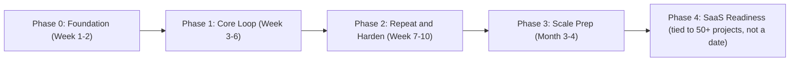

# WFACT 3.0: The Execution Roadmap

How this gets built, start to finish, from the technical cofounder seat. Written without spin: real timeframes, real risks, real open questions, not a pitch.

This document assumes the architecture already laid out in "WFACT 3.0: The Build Playbook" (the five pillars, the tech stack, the model choices). That document is the *what*. This one is the *how, in what order, and what it costs to get there*.

---

## 1. Operating principles

These are the rules I would actually run this by, stated up front so they can be checked against later, not just claimed:

1. **Verify, don't trust.** "Done" needs a check that isn't the same agent grading its own work. This is the single most expensive lesson 2.0 already paid for (a whole feature pack silently never installed), and it applies to WFACT's own build, not just client sites.
2. **Revenue before optimization.** Atif's principle from the Aug 26 call, and the right one: hosted APIs first, cost-cutting (local models, fine-tuning) only after there's real revenue and a real cost number to optimize against.
3. **One proven loop before parallel loops.** Get one client fully through the new pipeline before running three at once. Parallelizing an unproven process just multiplies the same defect three times.
4. **Decisions get an owner and a deadline, not an open debate.** The Claude Code vs Codex question does not get resolved by opinion, it gets resolved by a same-brief test with a date on it.
5. **Every phase ends with something real, not a status update.** A launched site, a measured number, a working round trip. Not "we made progress."

---

## 2. Governance: who decides what

This needs to be explicit before execution starts, because ambiguity here is exactly the kind of thing that stalls a build three weeks in.

| Decision area | Owner |
|---|---|
| Money, launch approval, client selection, final design call | Nick |
| Architecture, runtime/model choices, verification standards, build sequencing | Technical cofounder (this seat) |
| Rizm-side pricing and clients, margin/cost input, design taste | Atif |
| Planning, organization, content/promotion | Toby |

**Honest gap to flag**: this document is being written before compensation and the cofounder scope are formally closed. That is worth stating plainly rather than working around it. Asking someone to own architecture and build sequencing without that authority being formalized in writing is an execution risk, not just a personal one, because it means every technical call this document proposes is provisional until that conversation closes. I would treat closing it as part of Phase 0, not something that happens quietly in parallel.

---

## 3. Phase-by-phase plan

### Phase 0: Foundation (Week 1-2)

**Goal**: stop debating, get a working skeleton and every open decision closed or scheduled.

- Close the compensation/equity/scope conversation with Nick. Blocking, not technical, but everything after this assumes it is settled.
- Decide the repo architecture (fresh repo vs. carrying structure from WFact2.0) and create it.
- Set up the memory skeleton: `context.md`, per-client memory files, the lessons ledger, per the Playbook.
- Wire Hermes to at least one model (Claude) as a smoke test, nothing production yet, just prove the round trip works.
- Ship the idea-sharing app to the team. Already built, does not need to wait on anything else here.
- Run the Claude Code vs Codex bake-off: same brief, both tools, compare, decide.

**Exit criteria**: one repo exists, one working Hermes-to-model round trip exists, the build engine is decided, compensation is closed.

### Phase 1: Core Loop (Week 3-6)

**Goal**: get one real client through the entire pipeline on the new stack. Not a demo. A real project, start to launch.

- Build the cockpit MVP: just enough rooms to run a project (Pipeline, Approvals, Runs), not the full 2.0 room list yet.
- Wire the front-end loop (Kimi K3 + Motion Sites MCP) against a real template.
- Wire the QA/security loop (the 78-check registry and 50-point audit, carried over).
- Take one client through onboarding to launch on this stack. If there is no new client ready, redo DreamSign, since it is already the 2.0 benchmark case.

**Exit criteria**: one site actually launched through the new pipeline, with a correction-batch count measured and compared against the 40+ batches DreamSign took in 2.0. This is the actual test of whether 3.0 improved anything, not an opinion.

### Phase 2: Repeat and Harden (Week 7-10)

**Goal**: prove it repeats, not that it worked once.

- Run a second and third client through the pipeline, ideally overlapping, to test the loop structure under real concurrent load.
- Re-run the full 50-point security audit against the new build.
- Actually measure cost per client. This closes an item 2.0 never resolved (its own cost estimates were flagged UNVERIFIED).
- Decide the content/copywriting model, an open item nobody has assigned yet.

**Exit criteria**: three clients live, a real cost-per-client number in hand, no repeat of a lesson already in the ledger.

### Phase 3: Scale Prep (Month 3-4)

**Goal**: get ready for volume without breaking what's proven.

- Fix the cockpit's serverless ceiling (Vercel plan upgrade or the backend move described in the Playbook), before it becomes an outage under real load instead of after.
- Decide whether another technical hire is needed, or whether Hermes plus agents genuinely covers the load. Answer this with the Phase 1 to 2 workload data, not a guess.
- Begin the local/open-source model evaluation (Qwen, AirLLM), now that real cost data exists, per the condition the team already agreed to.
- Start multi-tenant groundwork for the eventual SaaS product, since outside agencies will eventually use this, not just WFACT's own team.

**Exit criteria**: the system handles five or more concurrent clients without manual firefighting.

### Phase 4: SaaS Readiness

**Goal**: the condition the 2.0 book already set: 50+ projects built, the machine not penetrable, no open security risk. This is deliberately not tied to a calendar date, and I would hold that line even under launch pressure, because shipping before that bar was met is exactly what produced the "I hate it" moment in 2.0.

---

## 4. What this honestly requires that isn't a technical problem

Worth stating plainly rather than glossing over, since it affects every timeline above:

- **Nick is the sole approver of launch and money, by design.** That's a deliberate safety mechanism, not a flaw, but it is a real bottleneck once project volume increases, and it should be acknowledged as one rather than discovered under pressure later.
- **Atif's time is split with his own Rizm client work.** He is not full-time on WFACT.
- **Toby's role is explicitly non-coding**, planning and promotion.
- **That leaves one technical person (this seat) owning architecture, build engine decisions, verification standards, and hands-on execution at the same time.** That is a bottleneck by construction, independent of how the work is prioritized. It is worth putting in front of Nick directly as part of the cofounder conversation, not discovered three months into the build when it's already costing time.

---

## 5. Success metrics

So "done" has a number attached, not a feeling.

| Metric | Baseline (2.0) | Target |
|---|---|---|
| Correction batches per project | 40+ (DreamSign), 26+ (Nick's front-end complaint) | Trending down each phase, measured, not assumed |
| Cost per client | Never measured (UNVERIFIED in 2.0) | Real number by end of Phase 2 |
| Time from signed to launched | Not tracked in 2.0 | Tracked from Phase 1 onward |
| Concurrent clients handled without manual intervention | Effectively zero (DreamSign was the only full flight) | 5+ by end of Phase 3 |
| Security audit pass rate | 36 PASS / 5 FAIL / 3 NOT-COVERED / 6 N-A (DreamSign, last recorded) | Re-run and improve at Phase 2 and again before Phase 4 |

---

## 6. Risk register

| Risk | Honest read | Mitigation |
|---|---|---|
| One-shot goal missed again | Likely on the original optimistic timeline, given 2.0 never got there in two months of trying | Keep template-first law until one-shot is actually proven, don't gamble the pipeline on an unproven from-scratch approach |
| Model pricing or availability shifts (Kimi K3, Claude, Codex) | Real, already happened once with model access changes elsewhere | Hermes stays model-agnostic by design, swap the model behind it, not the controller |
| Compensation/role not formalized before deep technical investment | Currently true as of this document | Close it in Phase 0, not after |
| Single point of technical failure (one technical hire) | Real, structural, not a criticism of anyone | Flag the hiring decision explicitly at Phase 3 with real workload data, don't wait for overload to force it |
| Local model migration underestimated | Training and hosting your own model is real engineering time, easy to under-budget | Don't start it before Phase 3, and only with a measured cost number driving the decision, not urgency |
| Nick's bandwidth as sole approver becomes a bottleneck | Likely once volume increases past a handful of concurrent clients | Surface this directly rather than quietly absorbing delays into the schedule |

---

## 7. What I would need to execute this

Stated plainly, because it is the same thing the Factory Book itself already describes for the CTO role, not a new ask:

- Decision authority over architecture and build tooling, formalized in writing, not verbal.
- Direct access to the existing repos and accounts needed to build.
- The compensation and scope conversation closed before Phase 1 starts in earnest, so the roadmap above is executed on a settled footing instead of a provisional one.

---

## 8. Sources

Builds on "WFACT 3.0: The Build Playbook," the Factory Book, the Technical Briefing, and the Aug 26 team call transcript. Phase timeframes are estimates based on team capacity as described in those sources (one technical hire, a part-time cofounder, a non-technical founder and a non-coding planner), not padded or compressed for effect.
