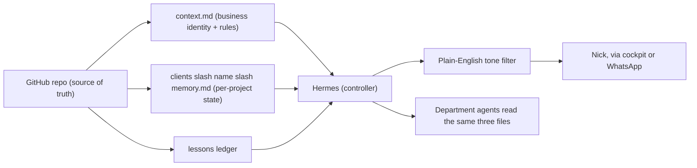
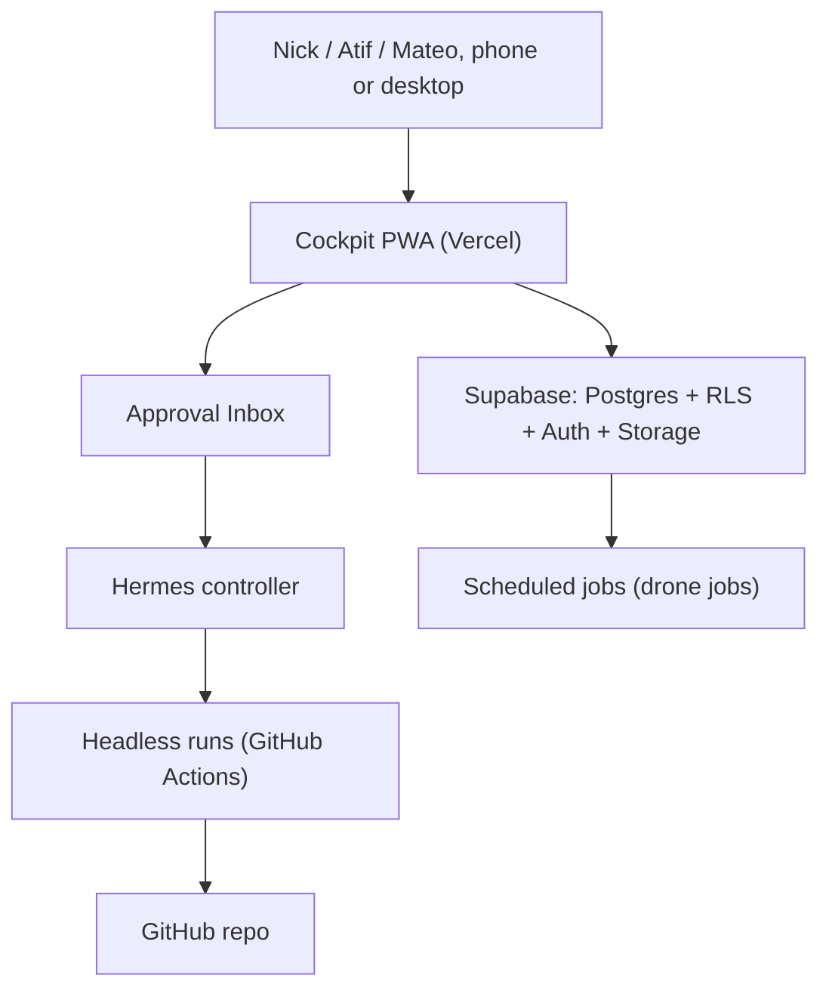
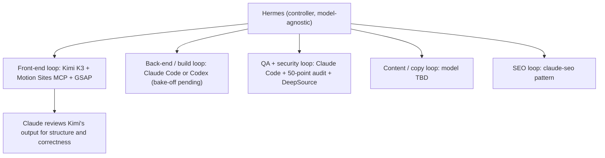
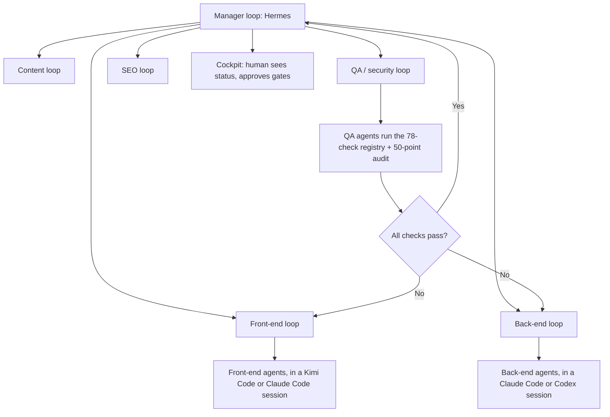
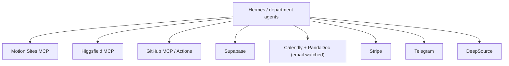

# WFACT 3.0: The Build Playbook

Prepared by Abu Huraira. Sources: the WFACT Factory Book (Aug 14), the WFACT Technical Briefing (Aug 14), and the WFACT 1st Team Meeting transcript (Aug 26, Nick, Toby, Atif, Abu Huraira).

## 0. How to read this document

Every claim below carries a status tag, the same discipline the 2.0 Factory Book used, because it is the one thing everyone on the call agreed worked:

- **CARRIED OVER**: proven in 2.0 by a real test, keep it as is.
- **DECIDED**: agreed explicitly on the Aug 26 call.
- **RECOMMENDED**: my call as technical lead, stated plainly, open to override.
- **TO TEST**: queued as an experiment, not yet decided.
- **OPEN**: unresolved, needs a decision before build starts.

Nothing here is invented. Where the record was silent, it says so.

---

## 1. The Five Pillars

On the call, Nick asked for the foundation pillars that everything else hangs off. Here they are, and this document is organized around them, one section per pillar:

1. **Memory** (the second brain): a single place holding business info, project state, and rules, that any model can read before doing work.
2. **The Factory itself**: WFACT as a web app (the cockpit) that uses the memory and the models to deliver results.
3. **The AI models**: one model matched to each job, not one model doing everything.
4. **The UI/UX**: has to be good enough to sell as a SaaS product later, not just usable internally.
5. **The build workflow**: which model/runtime actually constructs WFACT 3.0 itself (separate question from which model builds client websites).

---

## 2. What carries over from 2.0 (proven, do not rebuild)

| Item | Why it stays |
|---|---|
| Owner's Key (client self-editing) | Attacked and held: cross-client isolation, upload gates, both proven by real tests. |
| Entity law (DreamSign / Bennett & Co / Rizm, one client per entity) | Prevents wrong-entity paperwork, the "cardinal sin" per the book. Invoice engine already catches numbering bugs by test. |
| 50-point security audit + attack scripts | Real RLS attacks, real upload attacks, results printed honestly (including 3 items marked NOT COVERED). Keep the honesty, keep the tests. |
| Hosting law (Hostinger for live sites, Vercel for previews only) | Simple rule, zero ambiguity, already enforced by a guard script. |
| Gate + registry verification culture | The single most expensive lesson of 2.0: a whole feature pack was silently never installed. The 78-check registry that re-proves things on demand is what caught it. This is non-negotiable for 3.0. |
| Template-first doctrine | Standing law until one-shot is proven. The only approach that has actually shipped a full rebuild (DreamSign). |
| Mail engine pattern (event bus off email, not paid webhooks) | Cheap, already reached real leads. |

What does **not** carry over: unverified installs, doctrine that got rewritten mid-flight, features nobody ever clicked. If it was not tested, 3.0 does not inherit it just because it exists in the repo.

---

## 3. Pillar 1: Memory / The Second Brain

### The actual disagreement on the call

Nick said plainly he is not sure a second brain is even needed. Atif's framing was: whatever we use, it does not matter much because the GitHub repo is the real source of truth anyway. That is half right and worth being direct about: the repo is the ledger, but a ledger is not memory. Nobody, human or AI, reads 40,000 commits to remember what the business does. Something has to sit on top of the repo and summarize it. That is the second brain's actual job, nothing more mystical than that.

### What was tried before (Huraira's prior stack, described on the call)

GitHub repo, mirrored into Obsidian, connected through Hermes to chat channels (WhatsApp, Discord). Hermes pulled from the second brain to answer questions and route tasks. The weakness found in practice: Hermes tends to leak raw technical detail into chat replies, which is wrong for a channel a non-technical founder reads.

### RECOMMENDED approach for 3.0

Do not adopt a knowledge graph (Cognee or otherwise) on day one. That solves a problem you do not have evidence for yet, and the 2.0 book already parked it for exactly this reason. Instead:

1. **One `context.md` at the root of the repo.** Business identity, the three entities, active clients, current priorities, standing rules. This is the file every agent reads first, before touching anything else. (This is the same pattern FounderOS uses and it works at small scale: four questions, one file, every agent reads it before every task.)
2. **One memory file per client**, e.g. `clients/<name>/memory.md`: what stage they are in, what was decided, what is waiting on a human. Pre-filled from the questionnaire and call transcript per the existing 2.0 intake law (never ask twice).
3. **One lessons ledger**, carried over from 2.0 as is: never-repeat mistakes, owner veto included.
4. **Hermes reads all three, but its replies to Nick get filtered through a tone layer**: plain English only, no raw technical detail, unless Nick explicitly asks for it. This directly fixes the complaint raised live on the call.
5. Git remains the actual source of truth (per the 2.0 book's own law), the memory files are a summarized index into it, not a replacement for it.

Only move to a graph database or a dedicated memory product (Cognee, Mem0, Zep) once this flat-file version demonstrably cannot keep up, for example once there are 50+ live clients and cross-client pattern search becomes a real, measured need. That is a Phase 2 decision, not a launch decision.

---

## 4. Pillar 2: The Factory Itself (the Cockpit)

**CARRIED OVER**: React PWA on Vercel + Supabase (Postgres, RLS, auth, storage), role-based logins (owner, admin, PM), the room layout (Today, Pipeline, Inbox/Approvals, Requests, Runs, Money, SEO, Content, Health, Calendar, Team/Settings).

**A real problem to fix before scaling**: the cockpit is already at 12/12 on Vercel's Hobby serverless function ceiling, and it already caused a silent outage once. Two options:

- Upgrade to a paid Vercel tier that raises the ceiling. Fastest fix, keeps the current architecture.
- Move heavier backend logic (anything that is not a thin API route) off serverless functions into one persistent backend service. More work, but removes the ceiling problem permanently instead of buying more headroom under it.

**RECOMMENDED**: upgrade the plan now (it is cheap relative to the cost of another outage), and only do the architectural move if you cross the new ceiling too.

---

## 5. Pillar 3: The AI Models, One Per Job

### Controller: Hermes Agent

**DECIDED** on the call: Hermes Agent replaces Amir as the controller. Important clarification from the call, worth stating plainly because it was a point of confusion: Hermes is not itself a model. It is a manager that calls whichever model you configure behind it (Claude, GPT, Kimi, DeepSeek, whatever fits the job). So "should we use Hermes or Claude" is not actually the right question; the right question per job is "which model should Hermes call for this job."

**Known weakness, flagged live on the call**: Hermes tends to answer too technically for a non-technical founder. Fix: the tone filter described in Pillar 1, non-negotiable before Nick relies on it daily.

### Build engine: Claude Code vs Codex

**TO TEST**, genuinely undecided. From the call: Codex burns through tokens and hits usage limits fast. Claude Code has session limits that reset every few hours, and has been reliable in practice. Atif wants Codex tried because he was convinced by an outside conversation, not because it has been tested against Claude Code on this factory's actual work.

**RECOMMENDED**: run the bake-off the 2.0 book already proposed and never ran, same brief, both tools, side by side, before picking one as the default build engine. Do not decide this by opinion when a same-day test settles it.

### Front-end: Kimi K3 + Motion Sites MCP

**DECIDED direction** on the call: Kimi K3 for front-end generation, paired with the Motion Sites MCP (a template/motion library that was recently upgraded with proper MCP support) plus animation libraries (GSAP-style) and installed "taste" skills to keep output off the "slop" bar.

**OPEN**: whether a self-hostable / open-source version of Kimi K3 exists was checked on Hugging Face and not confirmed either way during the call. Plan for the hosted API as the default path, and only chase a self-hosted version once it is confirmed to exist and match quality.

Claude stays in the loop for review, structure, and correctness, per the original book's own finding: Kimi wins on visuals, Claude wins on code structure and catching Kimi's own mistakes.

### Local / open-source models (Qwen, AirLLM)

**DECIDED, explicitly deferred** on the call. Atif's argument, which the team accepted outright: do not reinvent the wheel before you have revenue. Validate that WFACT makes money on hosted APIs first (Claude, OpenAI). Only then invest in training or hosting an open-source model to cut margin, because that is a cost-optimization move, not a revenue move, and it is real engineering time that should not compete with getting the first paying, repeatable client through the pipeline.

This directly closes an item the 2.0 book flagged as UNVERIFIED: actual API cost per client was never measured. That measurement should happen during the hosted-API phase, so the local-model decision later is based on a real number instead of a guess.

### Per-department model map

| Department | Model / tool | Status |
|---|---|---|
| Controller / orchestration | Hermes Agent (model-agnostic manager) | DECIDED |
| Front-end build | Kimi K3 + Motion Sites MCP + GSAP + taste skills | DECIDED direction, open-source availability OPEN |
| Back-end / build engine | Claude Code or Codex | TO TEST (bake-off) |
| Code review / structure / correctness | Claude (model, not necessarily Claude Code) | CARRIED OVER from 2.0 finding |
| QA / security | Claude Code + the 50-point audit scripts + DeepSource once connected | CARRIED OVER, DeepSource still CHOSEN, NOT CONNECTED |
| Content / copywriting | To be defined per department, no model locked yet | OPEN |
| SEO | claude-seo plugin pattern, carried over | CARRIED OVER |
| Local / open-source (Qwen, AirLLM) | Deferred until revenue validated | DECIDED (deferred) |

---

## 6. Pillar 4: UI/UX Standard

**CARRIED OVER**: the Eyes (self-review scroll recording, frame by frame, before any human sees a link), the Mechanism Bank of named reusable motions, the anti-slop taste skill.

**New for 3.0, because the endgame is SaaS**: the cockpit itself needs to be held to the same design bar as client sites, not treated as an internal tool that gets a pass. Outside operators will eventually log into this thing and judge it the way they judge any paid product. Bennett Spooner's reference cockpit (see Section 9) is a useful bar to compare against for information density and navigation, even though his product is a different niche.

---

## 7. Pillar 5: The Build Workflow (agentic loops, agents, sub-agents)

### The loop pattern

On the call, reviewing Bennett Spooner's public reel, the working model that came out of it was: one manager loop overseeing several department sub-loops, each sub-loop staffed with agents carrying the skills for that department, each reporting status back up to the manager loop. Applied to WFACT:

- **Manager loop**: Hermes. Owns the full picture, decides what needs a human, reports up to the cockpit.
- **Front-end loop**: builds and iterates the site using Kimi K3 + Motion Sites MCP, reports back when a section passes its own checks.
- **Back-end loop**: builds server-side logic, integrations, data model.
- **Content loop**: copywriting, imagery (Higgsfield), the Content Bank carousels.
- **QA / security loop**: runs the registry checks and the 50-point audit, only reports "done" when the checks actually pass, never on the agent's own say-so.
- **SEO loop**: pre-launch gate, launch snapshot, monthly drift.

### Where agents actually "live"

Worth being precise here because it came up as a real point of confusion on the call: an agent is not a standing thing that lives somewhere permanent. It is a role plus a skillset, configured inside whichever runtime executes it (a Claude Code session, a Codex session, a Kimi Code session). You define the task, you attach the skills, the runtime executes it, it reports the result, the session ends. Thirty agents does not mean thirty permanently running things; it means thirty defined roles that get instantiated inside a runtime when there is work for them.

### The 11-stage client pipeline (carried over, unchanged unless noted)

```mermaid
flowchart LR
    S0["0 Onboarding"] --> S1["1 Intake"]
    S1 --> S2["2 Research and direction"]
    S2 --> S3["3 Assets"]
    S3 --> S4["4 Homepage build"]
    S4 --> S5["5 Direction lock (client sees it, milestone payment)"]
    S5 --> S6["6 Full build + Owner's Key"]
    S6 --> S7["7 QA and security"]
    S7 --> S8["8 Launch"]
    S8 --> S9["9 Content Bank"]
    S9 --> S10["10 Post-mortem"]
```

### The MCP layer

MCP is the plug that lets any runtime use any tool without rebuilding the integration each time. Needed for 3.0:

| MCP / integration | Purpose |
|---|---|
| Motion Sites MCP | Front-end template and motion library |
| Higgsfield MCP | In-house image/video generation, palette-locked |
| GitHub | The repo itself, Actions for headless runs |
| Supabase | Cockpit database, auth, storage |
| Calendly, PandaDoc | Booking and e-signature, watched via their emails, no paid webhooks |
| Stripe | Payment links (Bennett & Co account still needs connecting) |
| Telegram | Notifications |
| DeepSource | Static analysis, chosen but not yet connected |

### Verification harness

**CARRIED OVER, and extended**: the 78-check feature registry and the 50-point security audit fixed the single most expensive problem in 2.0, a whole feature pack silently never installed. For 3.0, the same discipline applies not just to client sites but to the factory's own build: no loop, no agent, no sub-agent gets marked "done" on its own report. A separate check (a script, a test, an attack, a second model reviewing the first) has to confirm it. "Never trust done, only verified" stays the first law.

---

## 8. Tech Stack and Tools, Full List

| Category | Choice | Status |
|---|---|---|
| Repo | Private GitHub monorepo (successor to WFact2.0) | CARRIED OVER, fresh repo for 3.0 |
| Cockpit frontend | React PWA on Vercel | CARRIED OVER |
| Cockpit backend/data | Supabase (Postgres, RLS, auth, storage) | CARRIED OVER |
| Controller | Hermes Agent | DECIDED |
| Build engine | Claude Code or Codex | TO TEST |
| Front-end model | Kimi K3 | DECIDED direction |
| Front-end library | Motion Sites MCP + GSAP-style animation | DECIDED |
| Local/open-source models | Qwen, AirLLM | DEFERRED |
| Hosting (client sites) | Hostinger | CARRIED OVER |
| Hosting (previews only) | Vercel | CARRIED OVER |
| Security scanning | gitleaks, npm audit, Anthropic security-review Action, DeepSource | CARRIED OVER + DeepSource pending connection |
| Email | Namecheap Private Email | CARRIED OVER |
| Notifications | Email, PWA push, Telegram | CARRIED OVER |
| Payments | Stripe | OPEN (Bennett & Co account not yet connected) |
| Docs / SOPs | Google Drive (3 SOPs + Ops Manual) | CARRIED OVER |
| Team idea capture | Huraira's own graph-based ideas app | DECIDED as immediate action item (see Section 10) |

---

## 9. Reference Point: Bennett Spooner / FounderOS

Nick flagged this as the closest public reference to what WFACT is trying to build, found after WFACT's own concept already existed. Worth being precise about the difference so it does not get over-copied: FounderOS is a general-purpose "run your business" system sold as a $5,000 cohort/masterclass to non-technical founders across any industry. WFACT is niched specifically to AI web agencies, sold eventually as $500 to $1,500/month SaaS to agencies and solo operators. The useful parts to borrow are structural, not the business model:

- The `context.md` onboarding pattern (four questions, one file, every agent reads it first), already folded into Pillar 1 above.
- The loop pattern (manager loop over department sub-loops), already folded into Pillar 5 above.
- A cockpit that is genuinely accessible from anywhere in the world on any device, already a stated WFACT goal, worth holding as a hard requirement rather than a nice-to-have.

---

## 10. Immediate Action Items (before the big build starts)

1. **Get the idea-sharing app live now.** Nick asked for this specifically and separately from this document: a place for the team to drop ideas without them getting buried in WhatsApp. Huraira already has a working version (graph view, entity-based auto-sorting). Ship it this week, it does not need to wait on anything else here.
2. **Run the Claude Code vs Codex bake-off** before committing the build engine choice.
3. **Confirm the repo architecture decision**: fresh repo vs carrying structure from WFact2.0.
4. **Get the compensation and scope conversation with Nick closed.** This document answers the technical questions Nick asked for; it does not substitute for that conversation.

---

## 11. Open Decisions and Experiments Queue

| Item | Status | Next step |
|---|---|---|
| Claude Code vs Codex as build engine | TO TEST | Same-brief bake-off |
| Kimi K3 open-source availability | OPEN | Confirm on Hugging Face / Kimi's own docs before assuming a self-hosted path exists |
| Second brain tooling beyond flat files | OPEN, deferred | Revisit only once flat-file version proves insufficient |
| Local/open-source model migration (Qwen, AirLLM) | DEFERRED | Revisit after real API cost per client is measured |
| Content/copywriting model | OPEN | Not yet discussed in detail |
| Cross-model review (one model grading another's build) | TO TEST | Carried over from the 2.0 book, never run |
| Repo architecture for 3.0 | OPEN | Needs a decision before build starts |

---

## 12. Sources

- WFACT Factory Book, Aug 14, 2026 (full 2.0 status audit).
- WFACT Technical Briefing, Aug 14, 2026.
- WFACT 1st Team Meeting transcript, Aug 26, 2026 (Nick, Toby, Atif, Abu Huraira), via Fireflies.
- FounderOS public site and GitHub repo (Bennettxai/FounderOS-DEMO), reviewed for structural reference only.

Everything tagged DECIDED comes directly from the Aug 26 call. Everything tagged RECOMMENDED is Huraira's own technical judgment, stated plainly, and open to override in the next conversation with Nick.
